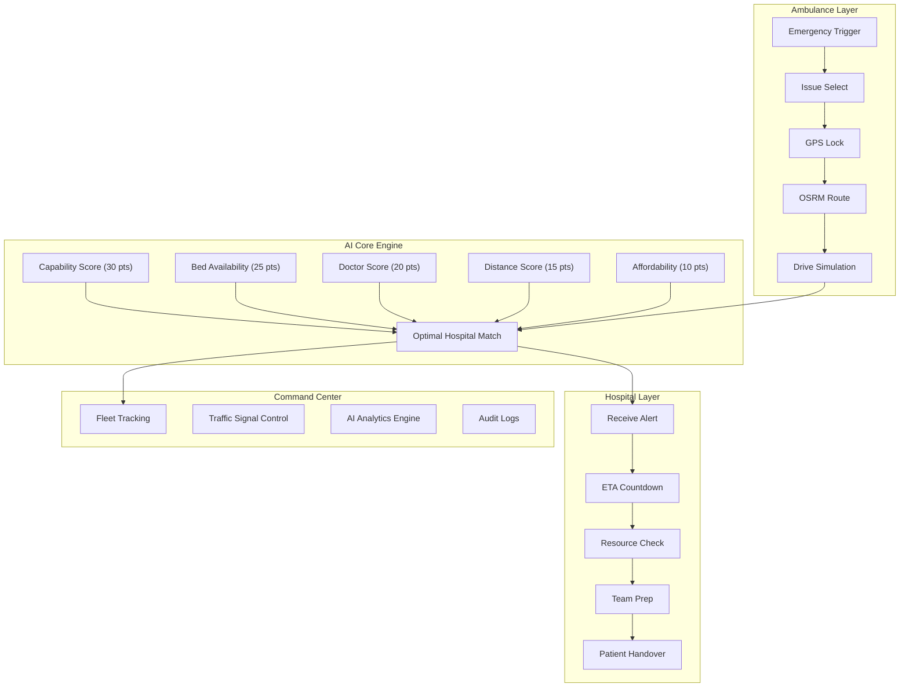
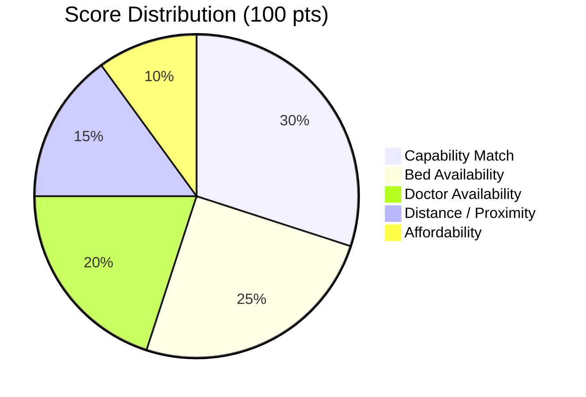

<div align="center">

# PRANA

### City-Wide Emergency Coordination Platform

[](https://nextjs.org/)
[](https://www.typescriptlang.org/)
[](https://tailwindcss.com/)
[](https://leafletjs.com/)
[]()

**Open-innovation platform unifying ambulances, hospitals, and traffic infrastructure into a single intelligent real-time system.**

[Getting Started](#getting-started) | [Architecture](#system-architecture) | [API Reference](#api-reference) | [Interfaces](#access-interfaces)

</div>

---

## About

PRANA bridges the fragmentation in emergency services by connecting on-board ambulance terminals, hospital dashboards, and traffic signal networks through a centralized coordination layer. The platform focuses on reducing golden-hour response times through AI-powered hospital matching, live GPS routing, and adaptive traffic signal preemption.

> [!IMPORTANT]
> PRANA is an open-innovation project. It uses simulated data for demonstration purposes and is designed to be modular, cloud-deployable, and extensible.

---

## Problem Statement

Emergency response systems in most cities suffer from critical fragmentation:

| Gap | Impact |
|:----|:-------|
| **No real-time ambulance intelligence** | Dispatchers lack live location and route data |
| **Hospital preparedness is invisible** | Crews cannot see bed availability, doctor capacity, or specialties across hospitals |
| **Traffic congestion delays** | No mechanism to preempt traffic signals along emergency routes |
| **No coordinated handoff** | Hospitals receive no advance notice of incoming patients, severity, or ETA |

PRANA addresses these gaps with a modular system designed around four priorities:

1. **Golden-hour response time reduction**
2. **Hospital overload prevention**
3. **Affordability-aware routing**
4. **Transparent, auditable decision-making**

---

## Core Capabilities

| Capability | Description |
|:-----------|:------------|
| **AI-Powered Hospital Matching** | Multi-criteria scoring engine (100-point scale) evaluates capability, bed availability, doctor count, distance, and affordability to allocate the optimal hospital |
| **Golden Hour Optimization** | Dynamic routing adjusts priorities in real time to minimize critical response windows |
| **Traffic Signal Preemption** | Adaptive signal control automatically clears intersections for approaching emergency vehicles within a 2.5 km radius |
| **Pre-Arrival Readiness** | Hospitals receive live patient context and ETA countdowns so teams can mobilize before the ambulance arrives |
| **Real-Time Telemetry** | Live GPS tracking, OSRM-based route visualization, and system-wide situational awareness across all connected nodes |
| **Transparent Decisions** | Every allocation generates an auditable trail explaining exactly why each hospital was selected |

---

## System Architecture



---

## Tech Stack

| Layer | Technology |
|:------|:-----------|
| **Framework** | Next.js 16 (App Router) |
| **Language** | TypeScript 5.7 |
| **Styling** | Tailwind CSS 4 |
| **UI Components** | Radix UI + shadcn/ui |
| **Maps** | Leaflet |
| **Charts** | Recharts |
| **Routing Engine** | OSRM (Open Source Routing Machine) |
| **Fonts** | Geist, Geist Mono |
| **Analytics** | Vercel Analytics |
| **Package Manager** | npm / pnpm |

---

## Getting Started

### Prerequisites

- **Node.js** 18 or higher
- **npm** or **pnpm**

### Installation

```bash
# Clone the repository
git clone https://github.com/shivarajm8234/PRANA.git
cd PRANA

# Install dependencies
npm install

# Start the development server
npm run dev
```

> [!TIP]
> The application will be available at [`http://localhost:3000`](http://localhost:3000) once the dev server starts.

### Build for Production

```bash
npm run build
npm start
```

---

## Access Interfaces

PRANA exposes three distinct interfaces, each designed for a specific user role:

### Ambulance Interface -- `/ambulance`

> **Role:** Paramedic crews

The on-board smart terminal provides one-tap emergency dispatch, live OSRM routing, traffic clearance status, AI hospital recommendations, and siren control.

### Hospital Dashboard -- `/hospital`

> **Role:** Hospital emergency staff

Displays incoming case alerts with ETA countdowns, a live city map with ambulance positions, resource management panels (ICU beds, general beds, doctors), and incident history.

> [!NOTE]
> Access is gated by hospital-specific access codes entered through the login page at `/hospital/login`.

### Command Center -- `/admin`

> **Role:** City-wide oversight / administrators

Features fleet tracking on a real-time map, traffic signal control, response time analytics, AI engine metrics, and a full incident audit log.

---

## Project Structure

<details>
<summary>Click to expand full directory tree</summary>

```
PRANA/
├── app/
│   ├── page.tsx                    # Landing page
│   ├── layout.tsx                  # Root layout with metadata and fonts
│   ├── globals.css                 # Global styles and Tailwind config
│   ├── admin/                      # Admin command center route
│   ├── ambulance/                  # Ambulance on-board interface route
│   ├── hospital/
│   │   ├── login/                  # Hospital login (access code)
│   │   └── page.tsx                # Hospital dashboard
│   └── api/
│       ├── hospitals/
│       │   ├── route.ts            # GET all hospitals
│       │   ├── [id]/route.ts       # GET hospital by ID
│       │   └── match/route.ts      # POST hospital matching
│       └── incidents/
│           ├── route.ts            # GET/POST incidents
│           └── [id]/route.ts       # GET/PATCH incident by ID
├── components/
│   ├── admin/
│   │   ├── AmbulanceTracker.tsx    # Live ambulance fleet map
│   │   ├── HospitalStatus.tsx      # Hospital capacity overview
│   │   ├── IncidentHistory.tsx     # Incident audit log
│   │   └── ResponseMetrics.tsx     # Response time analytics
│   ├── ambulance/
│   │   ├── BestHospitalCard.tsx    # AI-matched hospital recommendation
│   │   ├── EmergencyButton.tsx     # One-tap emergency trigger
│   │   ├── IssueSelector.tsx       # Emergency type selector
│   │   └── LiveMapView.tsx         # Live route map with navigation
│   ├── hospital/
│   │   ├── EtaCountdown.tsx        # Incoming ambulance ETA timer
│   │   ├── IncidentAlert.tsx       # New incident alert card
│   │   ├── IncidentList.tsx        # Active incidents list
│   │   ├── LiveCityMap.tsx         # City-wide map wrapper
│   │   ├── LiveCityMapInner.tsx    # Map implementation with markers
│   │   ├── ResourceStatus.tsx      # Bed/doctor resource panel
│   │   └── ServerStatus.tsx        # System connection status
│   ├── ui/                         # shadcn/ui component library (57 components)
│   └── theme-provider.tsx          # Dark/light theme provider
├── lib/
│   ├── engines/
│   │   └── HospitalMatchingEngine.ts  # AI scoring engine
│   ├── mock-data.ts                # Simulated city data
│   ├── types.ts                    # TypeScript interfaces
│   ├── utils.ts                    # Utility functions
│   └── utils/                      # Additional utilities
├── hooks/
│   ├── useAmbulanceLocation.ts     # Ambulance GPS tracking hook
│   ├── useHospitalSelection.ts     # Hospital matching hook
│   ├── use-mobile.ts               # Responsive breakpoint hook
│   └── use-toast.ts                # Toast notification hook
├── scripts/
│   └── update-osm-data.js          # OSM data update script
├── public/                         # Static assets and favicons
├── package.json
├── tsconfig.json
├── next.config.mjs
└── postcss.config.mjs
```

</details>

---

## API Reference

### Hospitals

| Method | Endpoint | Description |
|:-------|:---------|:------------|
| `GET` | `/api/hospitals` | List all hospitals with capacity data |
| `GET` | `/api/hospitals/[id]` | Get a specific hospital by ID |
| `POST` | `/api/hospitals/match` | Run the AI matching engine for a patient |

### Incidents

| Method | Endpoint | Description |
|:-------|:---------|:------------|
| `GET` | `/api/incidents` | List all active incidents |
| `POST` | `/api/incidents` | Create a new incident |
| `GET` | `/api/incidents/[id]` | Get incident details by ID |
| `PATCH` | `/api/incidents/[id]` | Update incident status |

<details>
<summary>Example: Hospital Match Request</summary>

```bash
curl -X POST http://localhost:3000/api/hospitals/match \
  -H "Content-Type: application/json" \
  -d '{
    "patientLocation": { "latitude": 12.9716, "longitude": 77.5946 },
    "issueType": "cardiac",
    "severity": "critical",
    "affordability": "standard"
  }'
```

</details>

---

## Hospital Matching Engine

The AI-powered hospital matching engine uses a weighted multi-criteria scoring system (0--100 points) to rank hospitals for each emergency.



| Criteria | Max Score | Description |
|:---------|:---------:|:------------|
| **Capability Match** | 30 | Full score if the hospital specializes in the required issue type; partial credit for general emergency capability |
| **Bed Availability** | 25 | Evaluates ICU and general bed capacity. Critical-severity cases receive a bonus for available ICU beds |
| **Doctor Availability** | 20 | Scores based on doctor count relative to a capacity threshold of 15 |
| **Distance / Proximity** | 15 | Linear scoring using Haversine distance. Full score at 0 km, zero at 20 km |
| **Affordability** | 10 | Matches patient preference (budget / standard / premium) against hospital tier |

> [!NOTE]
> The engine uses the **Haversine formula** for distance calculation and estimates arrival time at an average ambulance speed of **60 km/h**.

---

## Contributing

Contributions are welcome. Please open an issue to discuss proposed changes before submitting a pull request.

1. Fork the repository
2. Create your feature branch (`git checkout -b feature/your-feature`)
3. Commit your changes (`git commit -m "Add your feature"`)
4. Push to the branch (`git push origin feature/your-feature`)
5. Open a Pull Request

---

## License

This project is open source. See the repository for license details.

---

<div align="center">

**PRANA** -- Open Innovation | City-Wide | Modular | Cloud-Native

</div>
